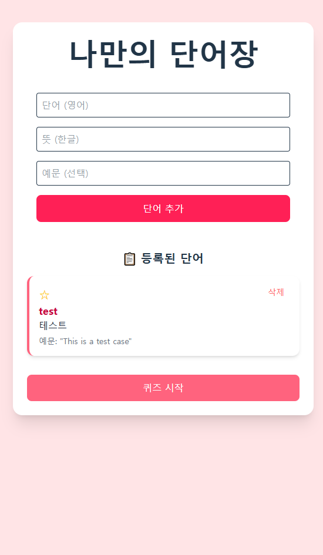

# 📘 Vocabulary Web App

단어를 등록하고, 북마크로 중요도를 설정하며, 퀴즈로 복습할 수 있는 React 기반 단어장 웹앱입니다.  
브라우저에 저장되는 로컬 데이터 기반으로, 별도 로그인 없이 사용 가능합니다.

---

## ✨ 주요 기능

✅ 영어 단어, 뜻, 예문 등록  
⭐ 북마크 기능으로 중요 단어 관리  
📋 단어 리스트 정렬 (북마크 우선 정렬, 해제 시 입력 순서 유지)  
🧠 랜덤 퀴즈 모드 (영-한 / 한-영 혼합 출제)  
📦 LocalStorage 기반 자동 저장  
🧩 React + TypeScript + TailwindCSS 기반 UI

---

## 📸 데모

👉 [배포 링크 보기](https://your-vercel-url.vercel.app)




---

## 🔧 기술 스택

| 기술         | 설명                         |
| ------------ | ---------------------------- |
| React        | 컴포넌트 기반 UI 개발        |
| TypeScript   | 정적 타입 안정성 확보        |
| Vite         | 빠른 개발 서버 및 번들링     |
| Tailwind CSS | 유틸리티 기반 CSS 프레임워크 |
| React Router | 페이지 분리 (퀴즈 페이지)    |
| uuid         | 단어 ID 고유값 생성          |

---

## 📁 프로젝트 구조

<code>
src/
├── components/ # 재사용 가능한 UI 컴포넌트
│ ├── WordForm.tsx # 단어 입력 폼
│ └── Quiz.tsx # 퀴즈 기능 UI
├── pages/
│ └── QuizPage.tsx # 퀴즈 라우팅 페이지
├── types/
│ └── word.ts # 단어 인터페이스 정의
├── App.tsx # 단어장 메인 기능 구현
└── main.tsx # 앱 진입점
</code>

---

## 🔍 폴더 설명

- `components/`: 입력 폼과 퀴즈 등 주요 기능 UI
- `pages/`: 퀴즈용 라우트 처리용 페이지
- `types/`: `Word` 타입 정의 (`id`, `term`, `meaning`, `bookmarked`, `createdAt` 등)
- `App.tsx`: 전체 앱 상태 및 로직 관리
- `main.tsx`: Vite 프로젝트의 진입점

---

## 🚀 실행 방법

```bash
# 패키지 설치
npm install

# 개발 서버 실행
npm run dev

# 브라우저에서 접속
http://localhost:5173

```

---

## 📄 라이선스

MIT License

---
